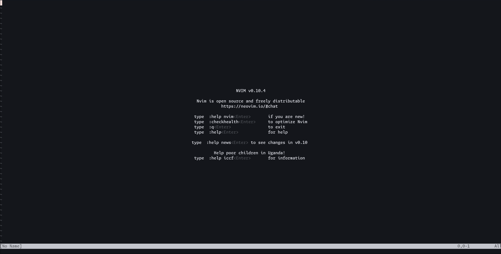

<h1 align="center">
  

  <p>The Wonder Of Neovim</p>
</h1>

## Table of content
- [Introduction](#introduction)
    + [So what is Neovim?](#what-is-neovim?)
    + [Why use Neovim?](#why-use-neovim?)
- [Installing Neovim](#installing-neovim)
    + [Linux](#linux)
    + [Windows](#windows)
    + [MacOS](#macos)
- [Navigation](#navigation)
    + [Basic Motion](#basic-motion)
    + [Saving and Quitting](#saving-and-quitting)
- [Plugins](#plugins)

## Introduction

If you're reading this, you might be familiar with code editor like Visual Studio Code, Sublime or IDEs like Dev C++, Pycharm,... They all have one thing in common is that they are resource-heavy and bloated. Sure some of them are indeed light-weight and some are heavy because of built-in features in them, but what if I told you Neovim can do the same thing but better and faster?

### So What Is Neovim?

Neovim is a highly extensible keyboard-based editor on terminal-based where your mouse is almost completely useless, and because of that, it can can improve your productivity since you won't need to touch the mouse. Neovim originally came from Vim or Vi and also a drop-in replacement of it, meaning Neovim are 99% identical to Vim but most of it's code base are refactored to be better, this also help the community to make faster and stronger plugins for Neovim.

### Why use Neovim?

Here are **3 reasons** why I pick Neovim for my daily coding editor:

1. It's insanely fast in navigation and minimalist workflow.
2. The Neovim customization is beyond your own limits (or someone else plugins/config).
3. Neovim is light-weight which can be run in everywhere (especially server).

## Installing Neovim

So you're here because you don't know how to install it or you did it but it's somehow broken or not working properly.

### Linux

Neovim exist in almost Linux distributions repositories due to its popularity so most likely you can install it using your distrubution's package manager.

1. Arch (btw)

```
$ sudo pacman -S neovim
```

2. Ubuntu/Debian

```
$ sudo apt install neovim
```

3. Fedora

```
$ sudo dnf install -y neovim python3-neovim
```

### Windows

If you using windows especially windows 11 then `winget` (A package manager for windows) already installed in your computer. Simply use this command to install.

```
winget install Neovim.Neovim
```

There's also alternative package manager for windows like Scoop or Chocolatey and if you using any of it, use these command

1. Scoop
```
scoop bucket add main
scoop install neovim
```

2. Chocolatey

```
choco install neovim
```

If you use neither of those then you can visit [Neovim official repo](https://github.com/neovim/neovim/releases/tag/v0.10.4) and look for `nvim-win64.msi`
### MacOS

If you using homebrew (which you should be), you can install Neovim with the following command:

```
brew install neovim
```

## Navigation

When you first open up Neovim and what first pop up is: 



You may think: __"How can this post claim Neovim outperforms my current editor, I literally can't even type!, how can I move around?, I can't do anything! **HOW DO I EXIT THIS?!?!?**"__.

That's because you haven't set everything up so it's can usable. Neovim becomes powerful when you learn how to use it and invest time customizing or install plugins to it.
### Basic Motion

First to open a file with Neovim use the following command: 

```
nvim <file_name>
```

If the file doesn't exist then Neovim will create a new one upon saving.

There are 4 main modes in Neovim: 

**NORMAL Mode (Default Mode)**
- Used for navigating and executing commands.
- Press `<ESC>` to return to this mode from other modes.

**INSERT Mode (Typing Mode)**
- Allows you to type like a normal editor.
- Press `i` to enter INSERT mode.

**VISUAL Mode (Selection Mode)**
- Used to select texts.
- Press `v` for selection.
- Press `V` for select entire line.

**Command-line** Mode (For Command)** 
- Press `:` to enter this mode.
- Used for command like saving and quitting.


Now we'll move on to Navigation or how to move around in **NORMAL** mode.

**Basic movements:** 

- `h` → Move left
- `l` → Move right
- `j` → Move down
- `k` → Move up

**Vertical movement:**

- `Ctrl + u` → Move **up** half a page
- `Ctrl + d` → Move **down** half a page
- `G` → Jump to the **bottom** of the file
- `gg` → Jump to the **top** of the file
- `{` → Move **up** by paragraph
- `}` → Move **down** by paragraph

**Searching**

- `/word` → Search **forward** for "word"
- `?word` → Search **backward** for "word"
- `n` → Jump to the **next** match
- `N` → Jump to the **previous** match
- `*` → Search for the **word under the cursor** forward
- `#` → Search for the **word under the cursor** backward

**Horizontal movements:**

- `w` → Jump **forward** to the start of the next word
- `e` → Jump **forward** to the end of the current/next word
- `b` → Jump **backward** to the start of the previous word
- `f<char>` → Jump to the next occurrence of `<char>` in the current line
- `F<char>` → Jump to the previous occurrence of `<char>` in the current line
- `;` → Repeat the last `f` or `F` search
- `,` → Repeat the last `f` or `F` search in reverse
- `$` → Jump to the **end** of the line
- `0` → Jump to the **beginning** of the line

**Editing Commands**
- `d` → Delete selected text
- `dd` → Delete the current line
- `y` → Yank (copy) selected text
- `yy` → Yank the current line
- `p` → Paste after the cursor


**Saving and Quitting**
- `:w` → Save the file
- `:q` → Quit Neovim
- `:wq` or `ZZ` → Save and quit
- `:q!` → Quit without saving

### Saving and quitting

To quit a file simply enter command mode then type `wq`

- `w` stands for saving a file.
- `q` stands for quitting a file.

So if you want to save or quit then use only one of them in command mode.

##### And this is almost every basic Neovim motion, it might hard at first that you cannot remember all of the keybinds but you can always learn to use it effectively but for now pick some that you think you will use the most and goes on till you master it. Also you can use `:help` to help you understand more about some about vim.

## Plugins

Now this one might be the most fun part because now you will try to install plugins into it to make it more powerfull. To make things easier, we will use a Neovim distro called kickstart.nvim. Unlike others distro where they did everything for you, this one only install the bare minimum for it like a package manager, LSP server,..., and some pre-configuration.

#### Requirements

- Neovim >= 0.8.0 (needs to be built with LuaJIT)
- Git >= 2.19.0 (for partial clones support) 
- a [Nerd Font](https://www.nerdfonts.com/) (optional but recommend for better experience)

#### Installation

First you need to locate where your Neovim configuration is locate

- For Linux simply go to `~/.config/nvim`.
- For Windows go to `Appdata/Local/nvim`. Or `%localappdata%\nvim\`
- For MacOS, it's basically the same for Linux `~/config/nvim`.

If it not exist, create one your own.

The recommended way to install Kickstart.nvim is to fork one your own from this [link](https://github.com/nvim-lua/kickstart.nvim) then install it by cloning the fork to your nvim folder by using this command below.

**Linux/Mac**

```sh
git clone https://github.com/nvim-lua/kickstart.nvim.git "${XDG_CONFIG_HOME:-$HOME/.config}"/nvim 
```

**Windows**


If you use `cmd.exe`
```
git clone https://github.com/nvim-lua/kickstart.nvim.git "%localappdata%\nvim"
```

If you use `powershell.exe`
```
git clone https://github.com/nvim-lua/kickstart.nvim.git "${env:LOCALAPPDATA}\nvim"
```

After you installed it Lazy.nvim (a package manager) will install all the plugins you have. Use `:Lazy` to view all the plugins status. Hit `q` to close the window.

|  |
|:--:| 
| *Lazy.nvim Example* |

Then you should briefly read the Friendly Document in `init.lua` from you nvim config folder to further understand about Neovim configuration.

If you did that then you should know where to put plugins so Lazy could install it. In case you don't, using search and find `require('lazy')` or just `lazy`. 

kickstart.nvim already setup for LSP server or IntelliSense you normally see in VS code and other IDE.

For example: To install new LSP like Python use command `:Mason` it'll have a popup that contain available LSP.


Then press `Ctrl + f` to filter out languages and find Python.


There're lots of LSP here but scroll down a bit and you'll see one called python-lsp-server.


Then press `i` to install it. After that Python should appear here.


Now whenever you open a python file the LSP should work out of the box like this:


Right now Neovim should work like a charm with autocomplete and suggestion but if you want to extend even more, you can visit this [github repo](https://github.com/rockerBOO/awesome-neovim) to find your favorite plugins

Also here are my list of current plugins I currently use: 

- ['numToStr/Comment.nvim'](https://github.com/numToStr/Comment.nvim)
- ['stevearc/oil.nvim'](https://github.com/stevearc/oil.nvim)
- ['windwp/nvim-autopairs'](https://github.com/windwp/nvim-autopairs)
- ['tribela/transparent.nvim'](https://github.com/tribela/transparent.nvim)
- ['folke/twilight.nvim'](https://github.com/folke/twilight.nvim)
- ['folke/zen-mode.nvim'](https://github.com/folke/zen-mode.nvim)
- ['ThePrimeagen/vim-be-good'](https://github.com/ThePrimeagen/vim-be-good)
